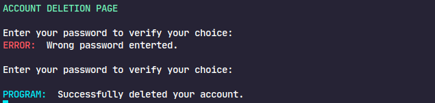

# Login Security System

Login Security System is a CLI Python program that provides a secure user account management system with various features like registration, login, changing username and password, logout, and account deletion. It is designed for use with Python 3.10 and later.

## Note
This point is to note that the program comes inbuilt with user-inputs, so there is no need to setup user input to run the program in advanced. This program is meant for CLI (Command Line Interface) programs ONLY. GUI (Graphical User Interface) programs are not supported by this.

## Features

- Can be easily inherited into subclasses
- Easy to use once understood
- Supports basic-level encryption
- Supports file-to-file encryption
- All functions can be smoothly integrated

## Getting Started

### Prerequisites

To use the Login Security System, you need to have Python 3.10 or later installed on your system.

### Installation

1. Clone the repository or download the `LoginSecurity.py` file to your local machine.

2. Open a terminal and navigate to the folder containing `LoginSecurity.py`, and import it into your project.

3. In order to use the class, import it in your main program, and either inherit the class or create a class object.

## Usage

### Demonstrated File

A file called `LoginSecurityDemonstration.py` is provided alongside the program which demonstrates the use of the class in simple a menu-driven application.

### Registration

1. Run the program and run the "register" function.

2. Enter a unique username.

3. Create a strong password (at least 6 characters) without spaces.

4. Your account will be successfully registered.

### Login

1. Run the program and run the "login" function.

2. Enter your username.

3. Enter your password.

4. If the provided username and password are correct, you will be logged in.

### Change Username

1. Run the program and run the "change_username" function.

2. Enter your old password for verification.

3. Enter your new desired username.

4. Your username will be updated.

### Change Password

1. Run the program and run the "change_password" function.

2. Enter your old password for verification.

3. Enter your new desired password.

4. Your password will be updated.

### Logout

1. Run the program and run the "logout" function.

2. You will be logged out of your account.

### Delete Account

1. Run the program and run the "delete_account" function.

2. Enter your password for verification.

3. Your account will be permanently deleted.

## Screenshots

Some screenshots related to the actual program:

Accounts file in which all the accounts will be stored:

Logs file:

## Developer

This program was solely developed by LeeTuah.

- [Instagram](https://www.instagram.com/leetuah7)
- [Discord](https://discordapp.com/users/755753736462401536)
- [Twitter](https://twitter.com/LeeTuahhhh)

## Acknowledgments

- [Termcolor](https://pypi.org/project/termcolor/): Library for colored text output in the terminal.

## License

This project is licensed under the MIT License - see the [LICENSE](LICENSE) file for details.

## TODOs

- Email-Based Registration (includes OTP)
- "Forgot Password" system (includes OTP)
- Improve Logging System
- Password Strength Checker
